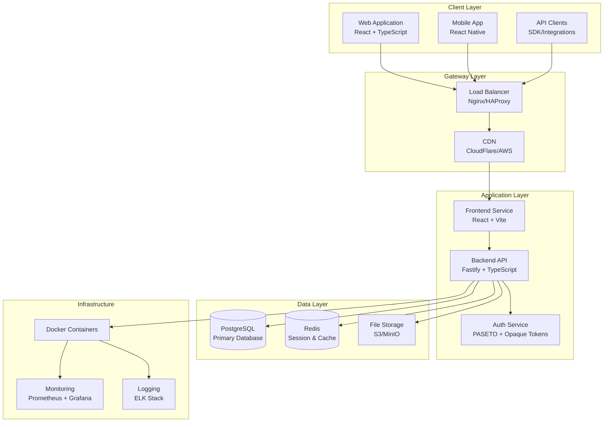
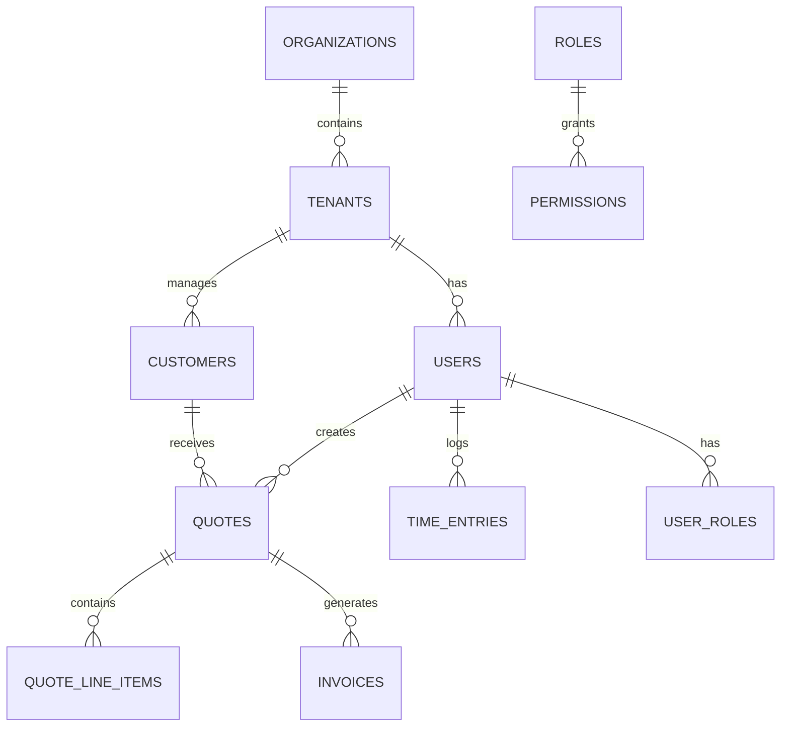

# Pivotal Flow System Architecture

## Overview

Pivotal Flow is a comprehensive business management platform built using modern web technologies with a focus on performance, security, and scalability. The system follows a microservices-oriented architecture with clear separation of concerns.

## High-Level Architecture

## Core Components

### **Frontend Application**
- **Framework**: React 18 with TypeScript
- **Build Tool**: Vite for fast development and optimized builds
- **State Management**: Zustand for global state, React Query for server state
- **UI Framework**: Custom component library with Tailwind CSS
- **Routing**: React Router with lazy loading and code splitting
- **Authentication**: Opaque token-based authentication with automatic refresh

### **Backend API**
- **Framework**: Fastify with TypeScript
- **ORM**: Drizzle ORM for type-safe database operations
- **Validation**: TypeBox for runtime type validation
- **Authentication**: PASETO + Opaque token system
- **Caching**: Redis for session storage and performance optimization
- **Documentation**: OpenAPI 3.0 with Swagger UI

### **Database Layer**
- **Primary Database**: PostgreSQL 16 with advanced features
- **Connection Pooling**: PgBouncer for efficient connection management
- **Backup Strategy**: Automated backups with point-in-time recovery
- **Monitoring**: Query performance monitoring and optimization

### **Caching Layer**
- **Session Storage**: Redis for opaque token session data
- **Application Cache**: Redis for frequently accessed data
- **CDN**: Static asset delivery and caching

## Security Architecture

### **Authentication & Authorization**
- **Token Type**: Opaque access tokens (15-minute expiry) + PASETO refresh tokens (30-day expiry)
- **Password Security**: Argon2id hashing with configurable parameters
- **Multi-Factor Authentication**: TOTP support for enhanced security
- **Session Management**: Redis-based session storage with activity tracking
- **Token Binding**: IP and User-Agent validation for enhanced security

### **Multi-Tenant Security**
- **Data Isolation**: Complete tenant data segregation at database level
- **Token Scoping**: Access tokens bound to specific tenant context
- **Permission System**: Granular role-based access control (RBAC)
- **Audit Logging**: Comprehensive activity tracking and compliance

### **Infrastructure Security**
- **Network Security**: TLS 1.3 for all communications
- **Container Security**: Docker image scanning and security hardening
- **Secrets Management**: Secure key storage and rotation
- **Compliance**: SOC 2, ISO 27001, GDPR compliance ready

## Data Architecture

### **Database Design**

### **Key Entities**
- **Organizations**: Top-level business entities
- **Tenants**: Isolated business units within organizations
- **Users**: Individual system users with role-based access
- **Customers**: External clients and prospects
- **Quotes**: Professional service proposals
- **Invoices**: Billing documents
- **Time Entries**: Work time tracking
- **Rate Cards**: Pricing structures

### **Data Flow**
1. **User Authentication**: Opaque token validation with Redis session lookup
2. **Request Processing**: TypeBox validation → Business Logic → Database Operations
3. **Response Generation**: Data transformation → Caching → Response delivery
4. **Audit Logging**: All operations logged for compliance and monitoring

## API Architecture

### **RESTful Design**
- **Base URL**: `/api/v1`
- **Authentication**: Bearer token in Authorization header
- **Content Type**: `application/json` for all requests/responses
- **Error Handling**: Consistent error response structure
- **Pagination**: Standardized pagination for list endpoints

### **Core API Modules**
- **Authentication**: Login, refresh, logout, user profile
- **User Management**: User CRUD, role assignment, permissions
- **Quote Management**: Quote lifecycle, line items, status tracking
- **Customer Management**: Customer profiles, contact management
- **Time Tracking**: Time entry logging, approvals, reporting
- **Invoice Management**: Invoice generation, payment tracking
- **Rate Cards**: Pricing structure management
- **Multi-Tenancy**: Tenant administration and switching

### **API Security**
- **Rate Limiting**: Per-user and per-endpoint rate limits
- **Input Validation**: Comprehensive TypeBox schema validation
- **SQL Injection Prevention**: Parameterized queries with Drizzle ORM
- **CORS Protection**: Strict origin validation
- **Audit Logging**: Complete API access logging

## Performance Architecture

### **Frontend Optimization**
- **Code Splitting**: Route-based lazy loading
- **Bundle Optimization**: Tree shaking and minification
- **Caching Strategy**: Service worker for static assets
- **Performance Monitoring**: Core Web Vitals tracking

### **Backend Optimization**
- **Connection Pooling**: Efficient database connection management
- **Query Optimization**: Indexed queries and query analysis
- **Caching Strategy**: Multi-layer caching with Redis
- **Load Balancing**: Horizontal scaling capabilities

### **Infrastructure Optimization**
- **Container Orchestration**: Docker with resource optimization
- **CDN Integration**: Global content delivery
- **Database Optimization**: Read replicas and query optimization
- **Monitoring**: Comprehensive performance metrics

## Deployment Architecture

### **Container Strategy**
- **Frontend Container**: Nginx + React application
- **Backend Container**: Node.js + Fastify application
- **Database Container**: PostgreSQL with persistent volumes
- **Cache Container**: Redis with persistence configuration

### **Environment Strategy**
- **Development**: Local Docker Compose setup
- **Staging**: Production-like environment for testing
- **Production**: Scalable cloud deployment with monitoring

### **CI/CD Pipeline**
- **Source Control**: Git with feature branch workflow
- **Automated Testing**: Unit, integration, and E2E tests
- **Build Process**: Automated Docker image building
- **Deployment**: Automated deployment with rollback capability

## Monitoring & Observability

### **Application Monitoring**
- **Health Checks**: Comprehensive service health monitoring
- **Performance Metrics**: Response time, throughput, error rates
- **Business Metrics**: User activity, feature usage, conversion rates
- **Alerting**: Proactive alerting for critical issues

### **Infrastructure Monitoring**
- **Resource Usage**: CPU, memory, disk, network monitoring
- **Database Performance**: Query performance and connection monitoring
- **Cache Performance**: Hit rates and memory usage monitoring
- **Security Monitoring**: Failed authentication attempts and suspicious activity

### **Logging Strategy**
- **Structured Logging**: JSON-formatted logs with correlation IDs
- **Log Aggregation**: Centralized log collection and analysis
- **Audit Logging**: Security and compliance event logging
- **Error Tracking**: Detailed error logging with stack traces

## Scalability Considerations

### **Horizontal Scaling**
- **Stateless Services**: Frontend and backend services are stateless
- **Database Scaling**: Read replicas and connection pooling
- **Cache Scaling**: Redis cluster for high availability
- **Load Balancing**: Multiple backend instances with load distribution

### **Performance Optimization**
- **Database Optimization**: Efficient queries and indexing strategy
- **Caching Strategy**: Multi-layer caching for frequently accessed data
- **CDN Integration**: Global content delivery for static assets
- **Resource Optimization**: Efficient resource utilization and monitoring

## Technology Stack

### **Frontend Technologies**
- React 18 with TypeScript
- Vite for build tooling
- Tailwind CSS for styling
- React Query for server state
- Zustand for client state
- React Router for navigation

### **Backend Technologies**
- Node.js 20+ with TypeScript
- Fastify web framework
- Drizzle ORM
- TypeBox validation
- PASETO token system
- Redis caching

### **Infrastructure Technologies**
- Docker and Docker Compose
- PostgreSQL 16
- Redis 7
- Nginx reverse proxy
- Prometheus monitoring
- Grafana dashboards

### **Development Tools**
- pnpm for package management
- ESLint and Prettier for code quality
- Vitest for testing
- Playwright for E2E testing
- Storybook for component development

---

*Last Updated: December 2024*
*Next Review: March 2025*
*Document Owner: Architecture Team*
